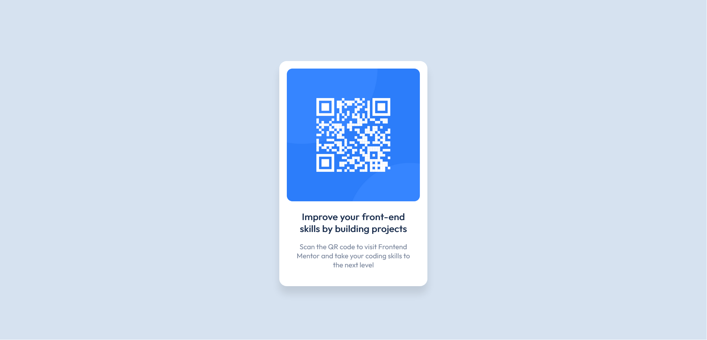

# Frontend Mentor - QR code component solution

This is my solution to the [QR code component challenge on Frontend Mentor](https://www.frontendmentor.io/challenges/qr-code-component-iux_sIO_H).

## Table of contents

- [Overview](#overview)
  - [Screenshot](#screenshot)
- [My process](#my-process)
  - [Built with](#built-with)
  - [What I learned](#what-i-learned)
  - [Continued development](#continued-development)
  - [Useful resources](#useful-resources)

## Overview

### Screenshot

## My process

### Built with

- Semantic HTML5 markup
- CSS custom properties
- Flexbox
- Mobile-first workflow

### What I learned

This was a refreshment of the following concepts: Importing google fonts, Flexbox and rem units usage.

Nothing too complicated, mobile design was implemented first and the desktop implementation was achieved with a simple `max-width: 300px` rule for the card element.

### Continued development

Replicating the box shadow was the most annoying part, along with the font boldness not looking exactly like the design despite using the font weight indicated in the style guide (700)

### Useful resources

- [Box Shadow Generator](https://developer.mozilla.org/en-US/docs/Web/CSS/CSS_Backgrounds_and_Borders/Box-shadow_generator) - This helped me get the box shadow as close as I can to the design in a quick and interactive way.
